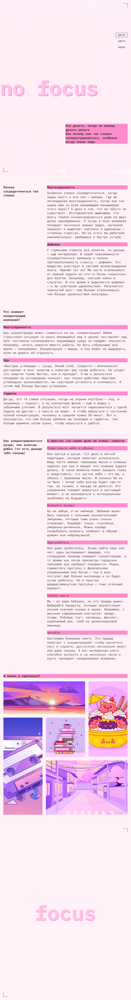

# slozhno-sosredotochitsya

https://github.com/StRaiGT/slozhno-sosredotochitsya.git

### Описание
3.2 Адаптивная верстка веб-страницы по макету с использованием переменных и состояний. 
Реализовано переключение между светлой и темной темами.

### Стек:
- HTML и CSS

[Ссылка на макет](https://www.figma.com/file/lCqDbWjgllgJtb2hmCqfyX/%236-%D0%A1%D0%BB%D0%BE%D0%B6%D0%BD%D0%BE-%D1%81%D0%BE%D1%81%D1%80%D0%B5%D0%B4%D0%BE%D1%82%D0%BE%D1%87%D0%B8%D1%82%D1%8C%D1%81%D1%8F?type=design&node-id=0-1&t=APAUXUcSQ3Pijp4O-0)

